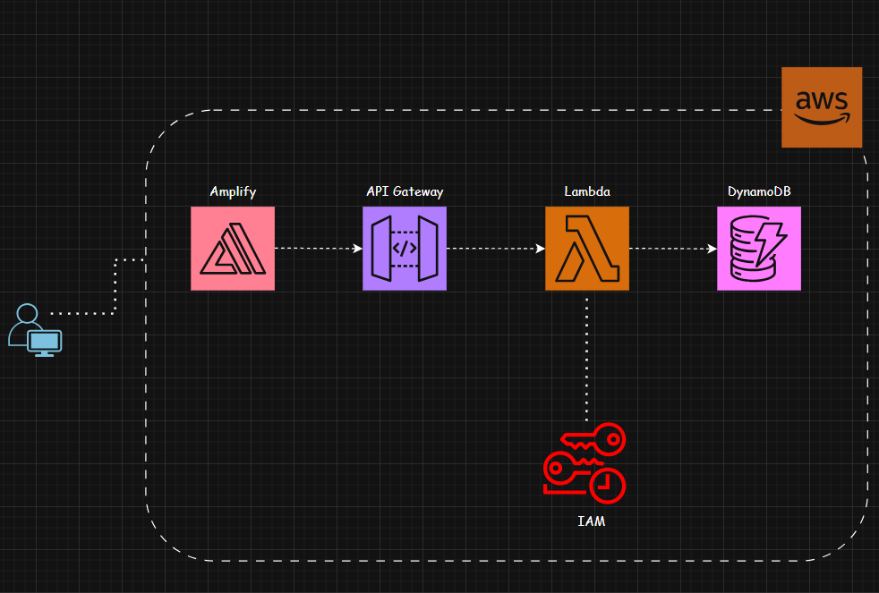
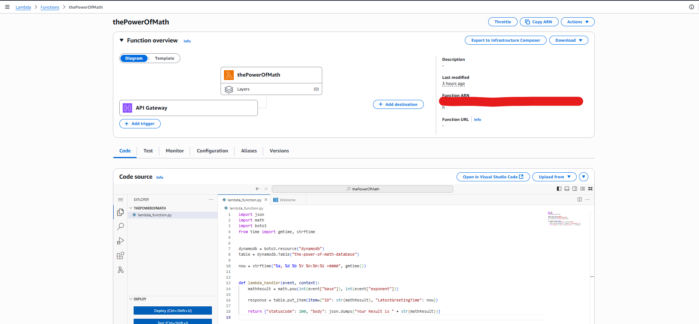
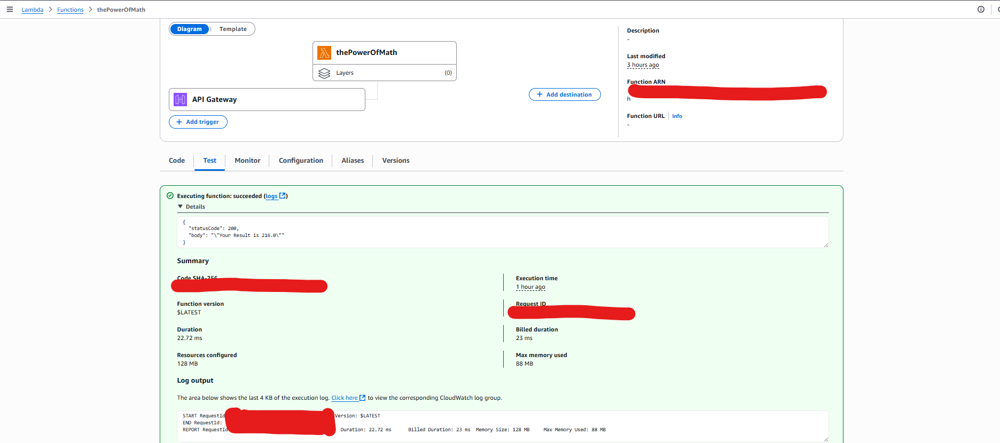
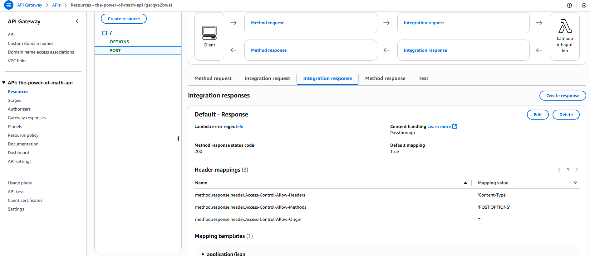
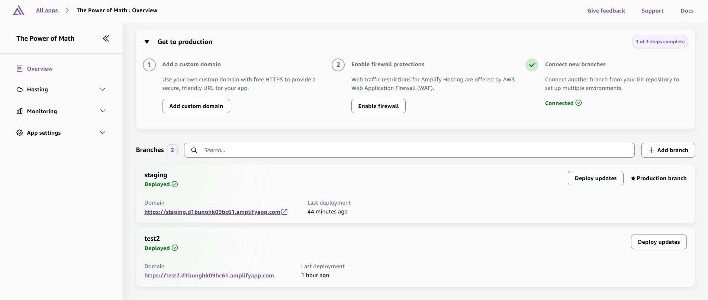
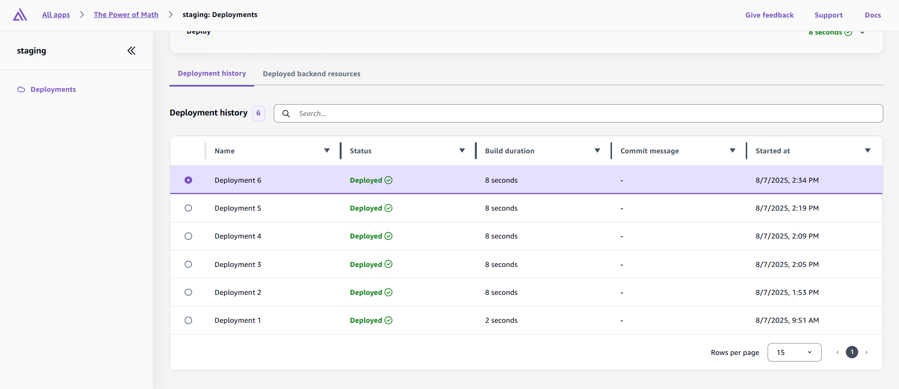
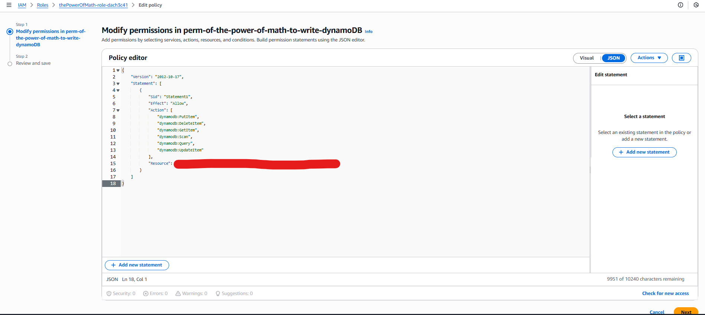

# ⚡️ The Power of Math (AWS Serverless Project)

This project is a simple **math calculator** that takes two inputs from the frontend and calculates the power of a number (base^exponent), using AWS services in a fully **serverless architecture**.

---

## 🧠 Features

- Static frontend hosted on **AWS Amplify**
- REST API powered by **API Gateway**
- Logic handled in **AWS Lambda** (Python)
- Data written into **DynamoDB**
- **IAM roles** for secure access
- Fully automated **CI/CD** with Amplify

---

## 🔧 Architecture Diagram

## 🖥️ Final Working UI

---

---

## ⚙️ AWS Lambda

Lambda function is written in **Python** and uses `math.pow` for calculation and writes to DynamoDB.

**Lambda Test Success**:

---

## 🧩 API Gateway Integration

Includes proper **CORS** setup and integration with Lambda.

---

## 🚀 AWS Amplify Hosting

The frontend is deployed and versioned using Amplify with support for multiple environments (e.g. `staging`, `test2`).

---

## 🔐 IAM Permissions

Lambda function uses an IAM role with permission to write to DynamoDB.

---

## 📦 Tech Stack

- Frontend: HTML + JS
- Backend: Python (AWS Lambda)
- Database: DynamoDB
- Infrastructure: API Gateway, IAM, Amplify

---

## 🧪 How to Run

1. Clone the repo
2. Deploy frontend with Amplify or locally with `Live Server`
3. Make sure your Lambda + API Gateway are deployed
4. Try the app!

---

## 📷 Screenshots

All screenshots above are taken from live deployments on AWS.

